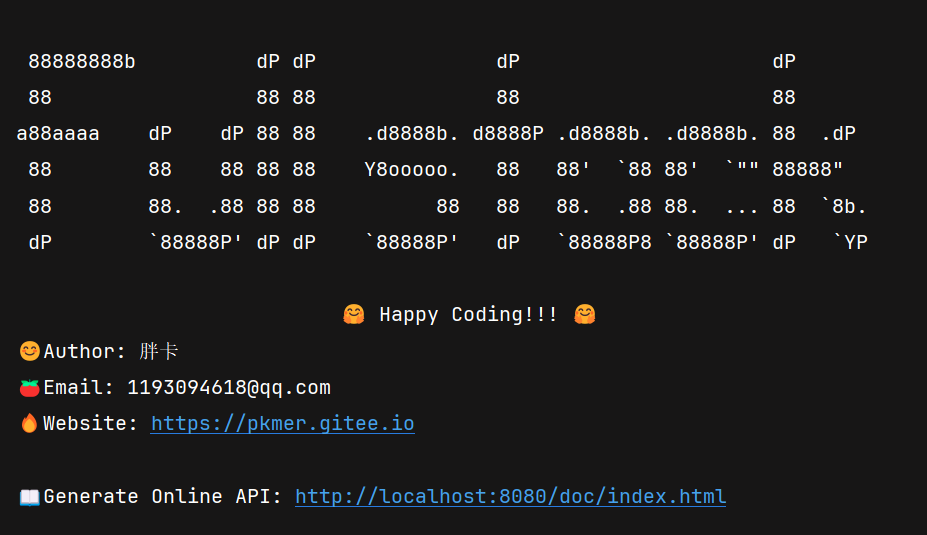

<table border=0>
  <tr>
    <td>
        😊Author: 胖卡<br/>
        🍅Email: 1193094618@qq.com<br/>
        🔥Coding is so much fun<br/>
    </td>
    <td>
      <div>
         
      </div>
    </td>
  </tr>
</table>


```vue
88888888b          dP dP               dP                     dP
88                 88 88               88                     88
a88aaaa    dP    dP 88 88    .d8888b. d8888P .d8888b. .d8888b. 88  .dP
88        88    88 88 88    Y8ooooo.   88   88'  `88 88'  `"" 88888"
88        88.  .88 88 88          88   88   88.  .88 88.  ... 88  `8b.
dP        `88888P' dP dP    `88888P'   dP   `88888P8 `88888P' dP   `YP

                           🤗 Happy Coding!!! 🤗
😊Author: 胖卡
🍅Email: 1193094618@qq.com
🔥Website: https://pkmer.gitee.io

📖Generate Online API: http://localhost:8080/doc/index.html
```


# 运行

进入到api根目录执行
```shell
mvn clean install
```
```shell
mvn -pl app-main spring-boot:run
```
`-pl`: This stands for "project list"
It allows you to specify which modules in your multi-module project you want to include


# 核心开发环境与版本

| Library             | Version |
|---------------------|---------|
| SpringBoot          | 3.3.0   |
| JDK                 | 17      |
| Maven               | 3.9.0   |
| MyBatis Spring Boot | 3.0.3   |
| MyBatis Generate    | 1.4.2   |
| hutool              | 5.8.28  |


## 开发环境

| 设施             | Version           |
|----------------|-------------------|
| Docker Desktop | 4.32.0            |
| Docker Compose | v2.28.1-desktop.1 |
| RabbitMQ       | 3.13.3            |
| MySQL          | 8.0               |
| Redis          | 7.2.5             |
| Caffeine       | 3.1.8             |

# 分模块开发

主程序是app-main
以依赖的方式来处理其他功能的jar包

如app-main的`pom.xml`,依赖auth-server

```xml
<dependency>
    <groupId>org.hzz</groupId>
    <artifactId>auth-server</artifactId>
    <version>1.0.0-SNAPSHOT</version>
</dependency>
```
开发完一个模块如app-auth需要install到本地。


| 模块                   |                              |
| -------------------- |------------------------------|
| app-main             | 程序入口                         |
| app-auth             | 认证父模块                        |
| auth-server          | 认证服务                         |
| app-framework-all    | 项目通用框架集合                     |
| app-mybatis-generate | mybatis逆向工程生成代码              |
| app-user             | 用户相关                         |
| app-learning         | 学习课程相关                       |
| attachment           | docker的挂载目录，目前是配置了rabbitmq插件 |


## app-framework-all子模块

> 这里我单独建立了一个父模块`app-framework-all`用于存储项目通用的模块代码，详情如下


| 模块                                    | 说明                                    |
|---------------------------------------|---------------------------------------|
| app-ddd-framework-core                | DDD核心概念，描述接口封装                        |
| app-convention-spring-boot-starter    | 项目的约定，比如异常，Result返回结果等                |
| app-security-spring-boot-starter      | JWT与password加密以及全局获取UserContext       |
| app-web-spring-boot-starter           | 封装了全局异常处理等                            |
| app-mybatis-spring-boot-starter       | 目前封装了逆向生成代码时的注释处理，雪花算法的主键生成           |
| app-designpattern-spring-boot-starter | 封装用到的设计模式的通用类                         |
| app-base-spring-boot-starter          | 目前扩展了spring的事件                        |
| app-rabbitmq-spring-boot-starter      | 封装了rabbitmq基础功能(序列化使用fastjson2)       |
| app-common-spring-boot-starter        | 封装了常用工具类                              |
| app-aop-spring-boot-starter           | 项目中自定义的切面,目前实现了添加了自动注解标记添加用户id过滤,用于分页 |
| app-fastjson2-spring-boot-starter     | 集成使用fastjson2,枚举序列化与反序列化              |

## 业务模块的ddd模块划分


| DDD业务模块        |                   |
|----------------|-------------------|
| interface      | 接口层               |
| application    | 应用层               |
| domain         | 领域层               |
| infrastructure | 基础层               |
| trigger        | 触发层,如微服务，mq消费者    |
| types          | 通用类型，如constants   |
| cache          | 缓存层,目前的话是Caffeine |


## 插件

| Maven Plugin                      | Version |
|:----------------------------------|---------|
| flyway-maven-plugin               | 10.13.0 |
| spring-boot-maven-plugin          | 3.3.0   |
| maven-release-plugin              | 3.0.1   |
| mybatis-generator-maven-plugin    | 1.4.2   |
| rabbitmq_delayed_message_exchange | 3.13.0  |

# 页面开发


| 页面      | 链接                                                                           |
|---------|------------------------------------------------------------------------------|
| 首页      | [http://localhost:8080/](http://localhost:8080/)                             |
| 404页面   | 路径错误就会显示                                                                     |
| 5xx页面   | 服务内部异常（如自己没有抛出的异常没处理）                                                        |
| 文档页面    | [http://localhost:8080/doc/index.html](http://localhost:8080/doc/index.html) |


# 项目搭建集成的开发工具

| 集成的开发工具                                |
|:---------------------------------------|
| 多模块热部署spring-boot-devtools             |
| 多模块版本控制maven-release                   |
| 启动springboot项目spring-boot-maven-plugin |
| 自动生成API文档springdoc-openapi             |
| 数据库版本控制flyway                          |
| maven 多模块开发                            |
| git版本控制，多分支开发,tag标记，release发布版本        |
| Gitee和Github远程仓库同步                     |
| JWT 认证 并解析成User封装到ThreadLocal中         |
| docker集成                               |
| MyBatis集成以及逆向工程生成代码                    |
| Valid 参数检验以及异常处理                       |
| 引入fastjson2,并配置枚举序列化                   |
| 引入password4j                           |
| 引入mapstruct对象映射                        |
| 系统自定义异常以及AppStatusCode完成               |
| DDD模式开发                                |
| 探索springboot3自动配置类,抽离模块成功              |
| mybatis插件，雪花算法生成ID                     |
| 数据库唯一键约束，幂等性防止消息重复消费                   |
| 分页逻辑抽离，包含排序和条件过滤                       |
| 自定义aop切面，基于注解                          |
| 手动校验分组参数,并实现全局异常处理                     |
| redis加延迟任务处理高并发业务                      |
| mybatis typehandler处理枚举                |
| 模版抽离：BaseEnum枚举以及mybatis typehandler   |


# 业务与技术特设


| 业务                 | 技术                                      |
|--------------------|-----------------------------------------|
| 视频提交记录             | redis+延迟任务                              |
| 分类层级               | List转Tree层级算法设计                         |
| 缓存caffeine分类信息     | JVM级别的缓存                                |
| admin分页查询问题        | 因为需要分类信息，在分类领域前面加了一层缓存                  |
| 视频记录提交与admin查看用户问答 | CompletableFuture.runAsync              |
| 更新评论数量解决并发         | update table replyTimes = relyTimes + 1 |
| mapstruct优化解耦ddd层  | 如分页查询的结果                                |

## 缓存技术

1. JVM级别使用了Caffeine
2. redis做了客户端的封装
3. 引入了springboot-cache对接是redis

# 附录

目前我有两个远程仓库[Github: VideosOnline](https://github.com/pkmer-cn/VideosOnline)和[Gitee: VideosOnline](https://gitee.com/developeros/videos-online)

在开发的时候，分支的开辟我只提交到[Gitee: VideosOnline](https://gitee.com/developeros/videos-online),而[Github: VideosOnline](https://github.com/pkmer-cn/VideosOnline)仓库只同步与[Gitee: VideosOnline](https://gitee.com/developeros/videos-online)的master分支




# 项目核心业务


| 业务  |     |
| --- | --- |
| 评论  |     |
| 问题  |     |
| 课程  |     |
