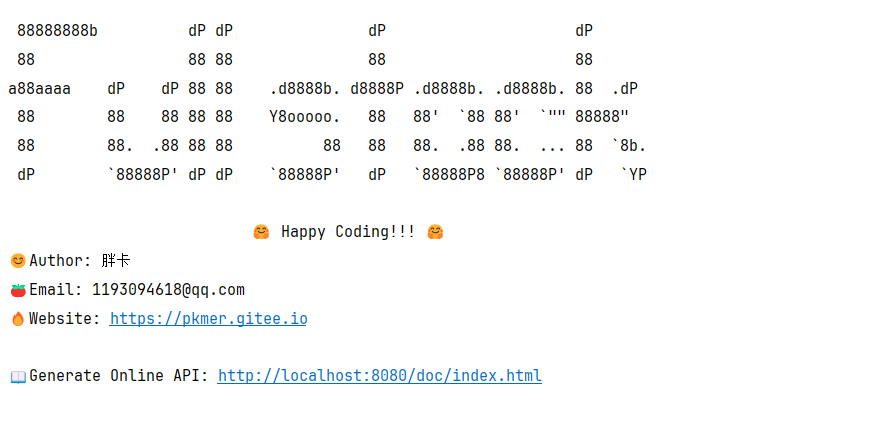

```vue
88888888b          dP dP               dP                     dP
88                 88 88               88                     88
a88aaaa    dP    dP 88 88    .d8888b. d8888P .d8888b. .d8888b. 88  .dP
88        88    88 88 88    Y8ooooo.   88   88'  `88 88'  `"" 88888"
88        88.  .88 88 88          88   88   88.  .88 88.  ... 88  `8b.
dP        `88888P' dP dP    `88888P'   dP   `88888P8 `88888P' dP   `YP

                           🤗 Happy Coding!!! 🤗
😊Author: 胖卡
🍅Email: 1193094618@qq.com
🔥Website: https://pkmer.gitee.io

📖Generate Online API: http://localhost:8080/doc/index.html
```


# 运行

进入到api根目录执行
```shell
mvn clean install
```
```shell
mvn -pl app-main spring-boot:run
```
`-pl`: This stands for "project list"
It allows you to specify which modules in your multi-module project you want to include


# 版本

| Library             | Version           |
|---------------------|-------------------|
| SpringBoot          | 3.3.0             |
| JDK                 | 17                |
| Maven               | 3.9.0             |
| Docker Compose      | v2.24.5-desktop.1 |
| MyBatis Spring Boot | 3.0.3             |
| MyBatis Generate    | 1.4.2             |


## 插件

| Maven Plugin                   | Version |
| :----------------------------- | ------- |
| flyway-maven-plugin            | 10.13.0 |
| spring-boot-maven-plugin       | 3.3.0   |
| maven-release-plugin           | 3.0.1   |
| mybatis-generator-maven-plugin | 1.4.2   |


# 项目搭建集成的开发工具

| 集成的开发工具                                |
|:---------------------------------------|
| 多模块热部署spring-boot-devtools             |
| 多模块版本控制maven-release                   |
| 启动springboot项目spring-boot-maven-plugin |
| 自动生成API文档springdoc-openapi             |
| 数据库版本控制flyway                          |
| maven 多模块开发                            |
| git版本控制，多分支开发,tag标记，release发布版本        |
| Gitee和Github远程仓库同步                     |
| JWT 认证                                 |
| docker集成                               |
| MyBatis集成以及逆向工程生成代码                    |


# 分包开发

主程序是app-main
以依赖的方式来处理其他功能的jar包

如app-main的`pom.xml`,依赖auth-seriver

```xml
<dependency>
    <groupId>org.hzz</groupId>
    <artifactId>auth-servier</artifactId>
    <version>1.0.0-SNAPSHOT</version>
</dependency>
```

开发完一个模块如app-auth需要install到本地。

# 附录

目前我有两个远程仓库[Github: VideosOnline](https://github.com/pkmer-cn/VideosOnline)和[Gitee: VideosOnline](https://gitee.com/developeros/videos-online)

在开发的时候，分支的开辟我只提交到[Gitee: VideosOnline](https://gitee.com/developeros/videos-online),而[Github: VideosOnline](https://github.com/pkmer-cn/VideosOnline)仓库只同步与[Gitee: VideosOnline](https://gitee.com/developeros/videos-online)的master分支




