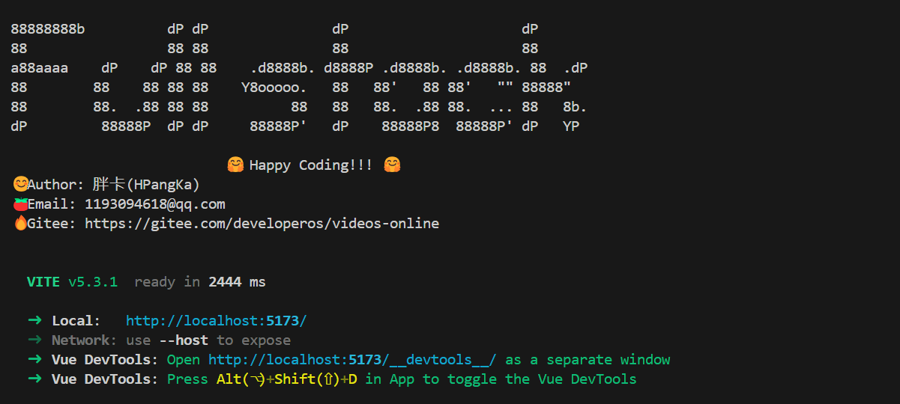

# 启动项目

```shell
yarn dev
```


# 版本

| 开发工具     | 版本        |
|----------|-----------|
| Vue      | 3.4.21    |
| sass     | 1.77.5    |
| yarn     | 1.22.22   |
| node     | 20.13.1   |
| tsx      | 4.15.4    |
| webstorm | 2024.1.4  |

# 项目技术亮点

| 用到的技术                |
|----------------------|
| Vite                 |
| vue3                 |
| TypeScript           |
| Sass                 |
| Composition API      |
| Composeable Function |
| 自建脚本Script           |
| 自建Icon组件             |


# 项目开发进度

1. 项目搭建
2. 脚本编写显示logo
3. 登录页面
4. axios与后端联调
4. router